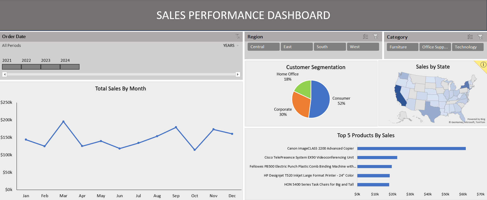

# Sales Performance Dashboard (Excel)

## Overview
This project showcases an interactive **Sales Performance Dashboard** built using Microsoft Excel to analyze sales trends, regional performance, and product-level insights.

## Objective
To provide a clear and interactive view of sales performance that helps stakeholders make data-driven decisions.

## Dashboard Preview

## Download Excel Dashboard
[Click here to download the Excel dashboard](Sales_performance_dashboard.xlsx)

## Tools Used
- Microsoft Excel
- Power Query (data cleaning & transformation)
- Pivot Tables
- Pivot Charts
- Slicers
- Timeline

## Key Insights
- Sales peak in March and increase again in November and December, indicating higher sales during the festival season.
- The Consumer segment tops the list, contributing the largest share in customer segmentation.
-  California and New York emerge as the top states with the highest sales.
- Canon imageCLASS 2200 Advanced Copier tops the sales list in both 2023 and 2024, indicating consistently strong demand.

## Features
- Fully interactive slicers and timeline
- Protected dashboard (only filters are editable)
- Clean and consistent layout for business users

## How to Use
1. Download the Excel file
2. Enable editing
3. Use slicers and timeline to explore sales performance

## Dataset
The dataset is publicly available and used for learning and portfolio demonstration purposes.

